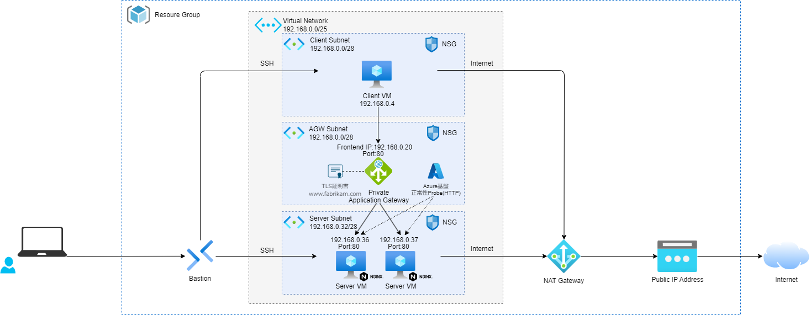

# Azure Loadbalancer PoC環境



## 前提条件

- [Private Application Gateway deployment (preview)](https://learn.microsoft.com/ja-jp/azure/application-gateway/application-gateway-private-deployment?tabs=cli#onboard-to-public-preview)を使用しているため、パブリック プレビューにオンボードする必要がある。
  ```
  az feature register --name EnableApplicationGatewayNetworkIsolation --namespace Microsoft.Network
  ```

## Virtual Machine

- Client VM/Server VM共にSSH公開鍵認証でBastionから接続する。
  - OSユーザー名はvariable.tfのvm_usernameに定義。
  - SSH秘密鍵はclient.pem,server.pemがtfファイルと同一フォルダに出力される。

- Server VM
  - カスタムスクリプトを利用してNGINXをインストールしている。
  - Server VMにPort80でHTTPアクセスすると、ホスト名を表示したHTMLページを返却する。
