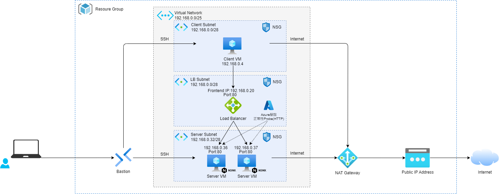

# Azure Loadbalancer PoC環境

## Virtual Machine

- Client VM/Server VM共にSSH公開鍵認証でBastionから接続する。
  - OSユーザー名はvariable.tfのvm_usernameに定義。
  - SSH秘密鍵はclient.pem,server.pemがtfファイルと同一フォルダに出力される。

- Server VM
  - カスタムスクリプトを利用してNGINXをインストールしている。
  - Server VMにPort80でHTTPアクセスすると、ホスト名を表示したHTMLページを返却する。
